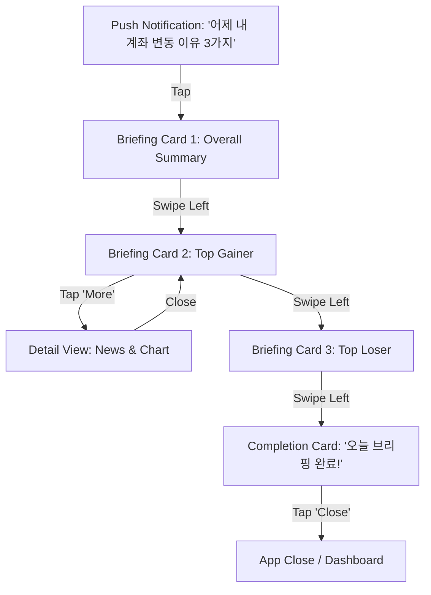

# UX Design Specification stock_brief

**Author:** Macpro14
**Date:** 2025-12-23

---

<!-- UX design content will be appended sequentially through collaborative workflow steps -->

## Executive Summary

### Project Vision

바쁜 직장인 투자자를 위해 매일 아침 전날의 주식 계좌 변동 이유를 3줄로 요약해주는 개인화 브리핑 서비스.

### Target Users

- **Primary:** 김민수 (32세, 핀테크 기획자) - 출근 전 10분 내에 계좌 현황 파악 니즈
- **Goal:** 여러 앱을 돌아다니지 않고 "왜 올랐/내렸는지" 빠르게 파악

### Key Design Challenges

1. **Information Density:** 1문장/3문장/3문단 등 정보 깊이 조절 UI를 직관적으로 제공해야 함.
2. **Trust & Clarity:** AI가 생성한 콘텐츠의 신뢰도를 높이기 위해 출처(Source)를 명확하면서도 방해되지 않게 표시해야 함.
3. **Habit Formation:** 매일 아침 8시 루틴으로 자리잡도록 알림 및 진입 경험 설계 필요.

### Design Opportunities

- **Adaptive UI:** 슬라이더 인터랙션으로 정보량 조절하는 독창적인 경험 제공
- **Contextual Help:** 어려운 용어를 탭했을 때 맥락을 끊지 않는 팝업 설명

## Core User Experience

### Defining Experience

**Core User Action:** 매일 아침, 전날 내 계좌 변동의 "이유"를 3줄 요약으로 확인하는 것.

### Platform Strategy

**Mobile-First Web App:** 출근길 지하철/버스에서 한 손으로 편하게 볼 수 있는 세로형 인터페이스.

### Effortless Interactions

- **Zero-Search:** 사용자가 종목을 검색할 필요 없이, 보유 종목이 자동으로 리스팅되고 설명이 제공되어야 함.
- **One-Thumb Navigation:** 스크롤과 탭만으로 모든 정보를 소비할 수 있어야 함 (복잡한 메뉴 이동 지양).

### Critical Success Moments

- **The "Aha" Moment:** 내가 궁금했던 종목의 급등/급락 이유를 별도 검색 없이 브리핑 첫 화면에서 즉시 확인했을 때.

### Experience Principles

1.  **Answer First:** "왜?"에 대한 답을 가장 먼저 보여준다.
2.  **Context on Demand:** 요약으로 시작하되, 원할 때만 깊은 정보(원문, 용어설명)를 제공한다.
3.  **Frictionless:** 로그인부터 정보 확인까지의 단계를 최소화한다.

## Desired Emotional Response

### Primary Emotional Goals

**"Relieved & Smart" (안도감 & 똑똑해진 기분)**
- 사용자가 계좌 변동의 원인을 명확히 알게 되어 불확실성에서 오는 불안감을 해소(Relieved).
- 습득한 정보를 통해 시장 상황을 이해하고 있다는 지적 효능감(Smart)을 느낌.

### Emotional Journey Mapping

- **Before:** "왜 떨어졌지?" (불안, 답답함)
- **During (Briefing):** "아, 이래서 그랬구나." (이해, 안도)
- **After:** "오늘도 시장 흐름을 파악했어." (뿌듯함, 통제감)

### Micro-Emotions

- **Trust:** 뉴스/공시 출처가 명확히 표기될 때 느끼는 신뢰감.
- **Control:** 정보의 길이(1줄/3줄/3문단)를 스스로 조절할 때 느끼는 통제감.

### Design Implications

- **Trust:** 출처 링크는 눈에 띄되, 본문을 방해하지 않는 위치(예: 문장 끝 각주 형태)에 배치.
- **Control:** 슬라이더 인터랙션은 즉각적인 피드백(햅틱 등)을 주어 조작감을 극대화.
- **Relief:** 상승/하락 색상을 너무 자극적이지 않게 사용(톤다운된 Red/Blue)하여 감정적 동요 최소화.

### Emotional Design Principles

1.  **Calm Confidence:** 정보는 명확하되, 디자인은 차분하게.
2.  **Transparent Intelligence:** AI의 분석 근거를 투명하게 공개하여 신뢰 형성.

## UX Pattern Analysis & Inspiration

### Inspiring Products Analysis

- **Toss:** 금융의 복잡함을 걷어내고 "가장 중요한 정보" 하나에 집중하게 하는 대담한 타이포그래피와 친근한 톤앤매너.
- **Axios:** "Smart Brevity" 철학. 바쁜 독자를 위해 뉴스를 "Why it matters", "Go deeper"로 구조화하여 전달.
- **Robinhood:** 직관적인 컬러 코딩과 인터랙션으로 금융 데이터를 시각적으로 즉시 이해하게 함.

### Transferable UX Patterns

- **Structured Summary (from Axios):** 3줄 요약을 단순 나열이 아닌, [현상] - [원인] - [전망]의 구조로 설계하여 정보 습득 효율 극대화.
- **Conversational Headers (from Toss):** 딱딱한 금융 용어 대신, "오늘 계좌가 오른 이유는..." 처럼 대화형 헤더 사용.
- **Visual Status (from Robinhood):** 상승/하락을 텍스트보다 컬러와 카드 배경으로 먼저 인지하도록 시각적 위계 설정.

### Anti-Patterns to Avoid

- **Over-Gamification:** Robinhood의 과도한 축하 효과(Confetti 등)는 지양. "Calm Confidence" 원칙에 따라 차분함 유지.
- **Data Overload:** 전통적인 MTS의 호가창, 차트 보조지표 등 복잡한 데이터 나열 금지. 오직 "이유" 설명에 필요한 데이터만 선별 노출.

### Design Inspiration Strategy

**"Toss의 친절함으로 Axios의 명쾌함을 전달한다."**
- UI는 Toss처럼 심플하고 큼직하게 가져가되, 콘텐츠 구조는 Axios의 논리적 요약 방식을 차용.
- 단, 맹목적인 카피를 지양하고 Stock Brief만의 "개인화된 맥락"을 강조하는 독창적 위젯/카드 디자인 개발.

## Design System Foundation

### Design System Choice

**Themeable System (Shadcn/ui + Tailwind CSS)**

### Rationale for Selection

1.  **Balance of Speed & Uniqueness:** Shadcn/ui는 컴포넌트의 소스 코드를 직접 가져와 수정할 수 있어, "Toss의 친절함"을 표현하기 위한 세밀한 커스터마이징이 가능하면서도 초기 개발 속도가 빠름.
2.  **Modern Stack:** React 생태계에서 가장 활발히 사용되는 스택으로, 유지보수와 확장성이 뛰어남.
3.  **Lightweight:** 불필요한 스타일을 최소화하여 모바일 웹에서의 성능 최적화에 유리.

### Implementation Approach

- **Base:** Tailwind CSS 기반의 유틸리티 퍼스트 스타일링.
- **Components:** Shadcn/ui 컴포넌트를 `src/components/ui`에 설치 후, Stock Brief의 디자인 언어(Roundness, Typography 등)에 맞춰 커스터마이징.
- **Icons:** Lucide React (Shadcn 기본) 사용.

### Customization Strategy

- **Typography:** Toss와 유사한 가독성 높은 산세리프 폰트(Pretendard 등) 적용.
- **Color Palette:** 신뢰감을 주는 Blue를 메인으로 하되, 상승/하락 컬러는 눈이 편안한 파스텔 톤으로 조정.
- **Radius:** 친근함을 위해 버튼과 카드의 모서리를 둥글게(Rounded-lg 이상) 처리.

## 2. Core User Experience

### 2.1 Defining Experience

**"The Morning Briefing Loop"**
사용자가 아침에 눈을 떠서 브리핑을 확인하고 "오늘 준비 끝!"을 느끼며 닫기까지의 완결된 흐름.

### 2.2 User Mental Model

- **Current:** 여러 뉴스 앱, 증권사 앱을 오가며 "왜?"를 찾아 헤맴 (파편화된 정보).
- **Desired:** "누가 딱 정리해서 떠먹여 줬으면 좋겠다" (비서/브리핑).
- **Expectation:** 알림을 누르면 즉시 본론이 나와야 함. 로딩이나 복잡한 메뉴 진입은 이탈 요인.

### 2.3 Success Criteria

- **Speed:** 알림 클릭 후 1초 내 브리핑 콘텐츠 노출.
- **Completion:** 사용자가 브리핑을 끝까지 읽고 "완료" 버튼을 누르는 비율.
- **Sentiment:** "오늘도 시장 흐름을 파악했다"는 안도감 획득.

### 2.4 Novel UX Patterns

- **Card-Based Briefing:** 일반적인 뉴스 리스트가 아닌, 한 장씩 넘기는 카드 형태의 브리핑 UI.
- **Progressive Disclosure:** 처음엔 3줄 요약만 보여주고, 관심 있을 때만 탭하여 상세 정보(원문, 차트)를 펼치는 인터랙션.

### 2.5 Experience Mechanics

1.  **Initiation:** 오전 8시 푸시 알림 "어제 내 계좌가 변한 이유 3가지" 도착.
2.  **Interaction:** 알림 탭 → 앱 진입 없이(또는 매우 빠르게) 브리핑 카드 모드 진입 → 스와이프로 이슈 확인.
3.  **Feedback:** 마지막 카드에서 "오늘 브리핑 완료" 메시지와 함께 완료 체크 애니메이션.
4.  **Completion:** 앱 종료 또는 '더 보기'를 통해 메인 대시보드로 이동.

## Visual Design Foundation

### Color System

- **Primary:** Trust Blue (#0052CC 계열) - 신뢰감과 전문성을 전달.
- **Status (Positive):** Soft Red (#FF4D4F 계열) - 상승을 의미하되, 너무 자극적이지 않게 톤다운.
- **Status (Negative):** Soft Blue (#40A9FF 계열) - 하락을 의미하되, 불안감을 줄이는 차분한 톤.
- **Background:** Clean White (#FFFFFF) & Light Gray (#F5F7FA) - 콘텐츠 집중도를 높이는 깔끔한 배경.

### Typography System

- **Primary Font:** **Pretendard** - 모바일 가독성이 뛰어나고 다양한 웨이트를 지원하는 산세리프.
- **Number Font:** **Inter** or **Roboto Mono** - 금융 데이터(숫자)의 가독성을 위해 고정폭 또는 숫자 디자인이 명확한 폰트 혼용.
- **Scale:**
    - **H1:** 24px (Bold) - 핵심 메시지
    - **H2:** 20px (SemiBold) - 섹션 타이틀
    - **Body:** 16px (Regular) - 본문
    - **Caption:** 13px (Medium) - 부가 정보

### Spacing & Layout Foundation

- **Base Unit:** 4px (Tailwind 기본)
- **Layout:**
    - **Airy:** 모바일 환경에서의 터치 영역 확보와 시원한 느낌을 위해 여백을 넉넉하게 사용 (Padding 16px~24px).
    - **Card-Based:** 각 정보 덩어리를 카드로 구분하여 시각적 인지 부하 감소.

### Accessibility Considerations

- **Contrast:** 텍스트와 배경 간 명도 대비 4.5:1 이상 준수 (WCAG AA).
- **Touch Target:** 모든 인터랙션 요소는 최소 44x44px 영역 확보.

## Design Direction Decision

### Chosen Direction

**The "Story" Style (Instagram-like)**

### Design Rationale

- **Immersive Focus:** 화면을 꽉 채우는 카드 UI를 통해, 사용자가 한 번에 하나의 이슈(Why)에만 온전히 집중할 수 있도록 유도.
- **Effortless Navigation:** 좌우 탭/스와이프 인터랙션은 한 손 조작이 매우 간편하여, 붐비는 출근길 지하철/버스에서도 쾌적한 사용성 제공.
- **Visual Satisfaction:** 텍스트 위주의 리스트보다 시각적으로 풍부하고 트렌디한 느낌을 주어 "Smart & Trendy"한 감성 전달.

### Implementation Approach

- **Layout:** Full-screen Card Layout.
- **Navigation:**
    - **Tap Left/Right:** 이전/다음 이슈 이동.
    - **Progress Bar:** 상단에 총 이슈 개수와 현재 위치를 보여주는 Story Indicator 배치.
- **Motion:** 부드러운 카드 전환 애니메이션 적용 (Slide or Stack effect).

## User Journey Flows

### Morning Briefing Flow

### Journey Patterns

- **Linear Navigation:** 복잡한 분기 없이 한 방향(오른쪽)으로만 진행하면 완료되는 선형 구조.
- **Modal Detail:** 상세 정보는 페이지 이동이 아닌 모달/오버레이 형태로 띄워, 닫으면 즉시 원래 흐름으로 복귀.

### Flow Optimization Principles

- **One-Way Street:** 사용자가 "어디로 가야 하지?" 고민하지 않도록 오직 '다음'으로만 유도.
- **Instant Gratification:** 앱 실행 즉시 콘텐츠 노출 (로딩 스켈레톤 최소화).

## Component Strategy

### Design System Components (Shadcn/ui)

- **Button:** CTA 및 보조 액션.
- **Sheet (Drawer):** 상세 정보(Detail View) 모달 구현용.
- **Skeleton:** 데이터 로딩 시 스켈레톤 UI.
- **Badge:** 상승/하락 퍼센트 표시.

### Custom Components

#### 1. Briefing Card (Core)
- **Purpose:** 핵심 이슈 하나를 몰입감 있게 전달.
- **Anatomy:** 
  - Background (Status Color)
  - Header (Conversational Title)
  - Body (Structured 3-Line Summary)
  - Footer (Action: '더 보기')
- **Interaction:** Swipe Left/Right.

#### 2. Story Indicator
- **Purpose:** 전체 브리핑 진행 상황 표시.
- **Anatomy:** 상단 가로 막대 (Segmented Progress Bar).
- **State:** Active (Filled) / Inactive (Empty).

#### 3. Detail Sheet
- **Purpose:** 이슈에 대한 심층 정보 제공.
- **Anatomy:** Bottom Sheet 형태. 뉴스 원문, 차트, 용어 설명 포함.

### Implementation Roadmap

- **Phase 1 (MVP):** Briefing Card, Story Indicator, Detail Sheet, Button, Skeleton.
- **Phase 2 (Enhancement):** Settings Panel, Archive List.

## UX Consistency Patterns

### Navigation Patterns

- **Swipe Left / Tap Right Edge:** 다음 이슈로 이동 (Next).
- **Swipe Right / Tap Left Edge:** 이전 이슈로 이동 (Prev).
- **Tap Center / 'More' Button:** 상세 정보 모달 열기 (Open Detail).
- **Swipe Down (on Modal) / Close Button:** 상세 정보 닫기 (Close Detail).

### Feedback Patterns

- **Haptic Feedback:** 카드 전환 시 미세한 진동을 주어 물리적인 넘김 효과(손맛) 제공.
- **Completion Feedback:** 마지막 카드를 넘길 때 성공 사운드 또는 강한 진동으로 "완료"의 성취감 전달.

### Loading Patterns

- **Skeleton UI:** 데이터 로딩 시 빈 화면이나 스피너 대신, 카드 구조(제목, 본문 영역)를 미리 보여주는 스켈레톤 UI 적용하여 체감 대기 시간 단축.

## Responsive Design & Accessibility

### Responsive Strategy

- **Mobile-First:** 모든 디자인과 인터랙션은 모바일(360px~) 환경을 최우선으로 설계.
- **App-Like Layout (Desktop):** 데스크탑 등 큰 화면에서도 웹사이트처럼 퍼지지 않고, 중앙에 모바일 비율(최대 너비 480px 등)을 유지하는 컨테이너 레이아웃 적용. 좌우 여백은 블러 처리된 배경 등으로 마감하여 몰입감 유지.

### Accessibility Strategy

- **WCAG AA Compliance:** 텍스트 명도 대비 4.5:1 이상 준수.
- **Screen Reader:** 이미지, 아이콘 버튼에 명확한 `aria-label` 제공. (예: "다음 이슈 보기", "상세 정보 닫기")
- **Keyboard Navigation:** 키보드 화살표(←/→)로 카드 넘기기, ESC로 모달 닫기 지원하여 접근성 강화.

### Testing Strategy

- **Device Testing:** iOS/Android 모바일 브라우저(Safari, Chrome) 및 데스크탑 브라우저 크로스 테스팅.
- **Accessibility Testing:** Lighthouse 접근성 점수 90점 이상 목표.
